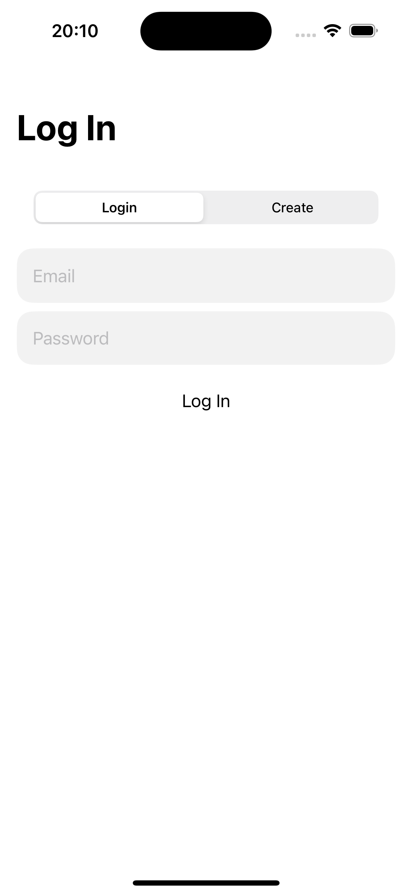
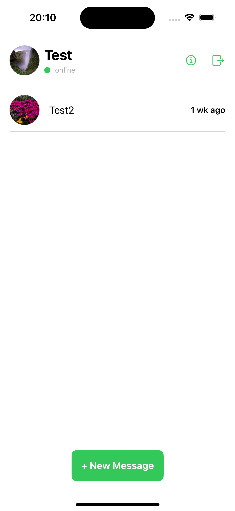
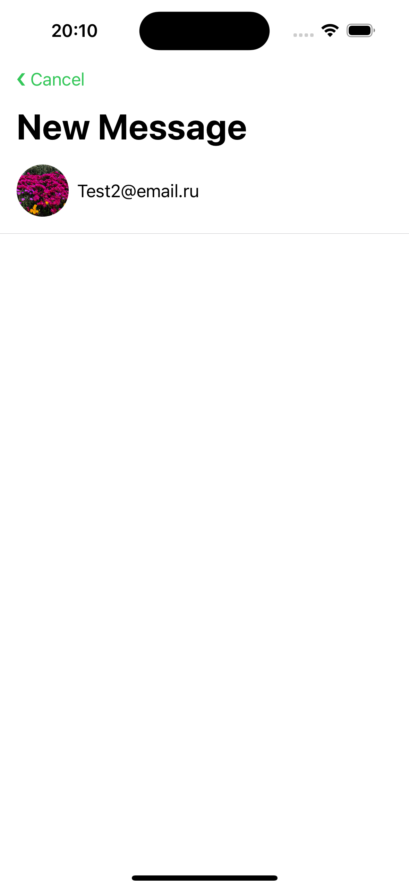
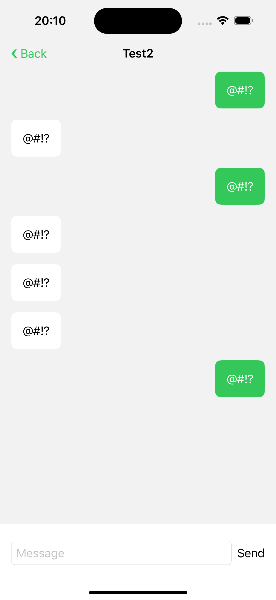

# Chat

Реализация приложения мессенжер. (Дипломная работа)

Документация: Отчёт.pdf

## About

Работа использует уникальный потоковый шифр для сообщений. 
Возможность 3-х лиц прочитать сообщения отсутсвует.

Стек технологий:

* MVVM
* Crypto
* WebImage
* Firebase
* UserDefaults

## How it work

> При старте программа требует авторизации/регистрации пользователя в системе firebase. Мессенджер использует ассиметричное шифрование для общения исключительно двух устройств. Шифрование происходит симметрично, используя потоковый шифр. При смене учётной записи, ключи шифрования меняются, предыдущие переписки становятся недоступны. 

## Example

  
  
  
  

## Support

tg: @swissmer